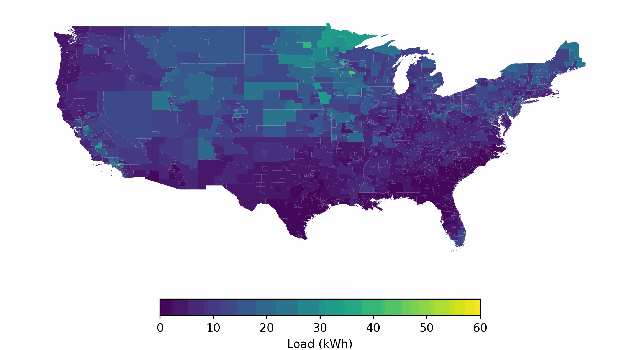

 [](https://opensource.org/licenses/BSD-3-Clause)

# Welcome to BuildingsBench!



## ❗️Update for surrogate model training
- Refactored ```buildings900K.py```. It now supports data loading for surrogate model training, which expects the index file that has one building per row and ignores seq_ptr. It randomly selects a sequence of length = pred_len on the fly, where the starting index is in range [1, 8736 - pred_len], where 8736 is the total number of hours in a year and we skip the first hour of the first day due to missing weather data. More details on creating simcap index files can be found ```script/create_index_files_simcap.py```.
- Added a ```BaseSurrogateModel``` abstract class and implemented surrogate model class ```ResNet``` that makes prediction on single timestamp with residual connections. Added configuration files for small resnets ```ResNet-S``` and ```ResNet-Text-S``` with text embedding. 
- Added scripts for caption generation, post processing, BERT embedding generation in parallel.

## Overview 

BuildingsBench is a platform for
- Large-scale pretraining with the synthetic Buildings-900K dataset for short-term load forecasting (STLF). Buildings-900K is statistically representative of the entire U.S. building stock and is extracted from the NREL [End-Use Load Profiles database](https://www.nrel.gov/buildings/end-use-load-profiles.html).
- Benchmarking on two tasks evaluating generalization: zero-shot STLF and transfer learning for STLF.

We provide an index-based PyTorch Dataset for large-scale pretraining, easy data loading for multiple real building energy consumption datasets as PyTorch Tensors or Pandas DataFrames, simple (persistence) to advanced (transformer) baselines, metrics management, and more.


Read more about BuildingsBench in our [paper](https://arxiv.org/abs/2307.00142) and [documentation](https://nrel.github.io/BuildingsBench/).

## Installation

If you aren't going to pretrain or evaluate models and just want access to the provided dataloaders, model code, metrics computation, etc., install the package with:

```bash
pip install buildings_bench
```

### Full installation

Otherwise, clone this repository and install it in editable mode in a virtual environment or a conda environment.

1. Create an environment with `python>=3.8`, for example: `conda create -n buildings_bench python=3.8`.
2. Install the package in editable mode with
```bash
git clone https://github.com/NREL/BuildingsBench.git
cd BuildingsBench
pip install -e ".[benchmark]"
```

### Installing faiss-gpu

Due to a PyPI limitation, we have to install `faiss-gpu` (for KMeans) by directly downloading the wheel from [https://github.com/kyamagu/faiss-wheels/releases/](https://github.com/kyamagu/faiss-wheels/releases/).
Download the wheel for the python version you are using, then install it in your environment.

For example:

```bash
wget https://github.com/kyamagu/faiss-wheels/releases/download/v1.7.3/faiss_gpu-1.7.3-cp38-cp38-manylinux_2_17_x86_64.manylinux2014_x86_64.whl

pip install faiss_gpu-1.7.3-cp38-cp38-manylinux2014_x86_64.whl
```

### [Optional] Installing LightGBM

If running the LightGBM baseline, you will need to install LightGBM.

1. Follow instructions [here](https://pypi.org/project/lightgbm/) to install `lightgbm` for your OS. 
2. Then install `skforecast` with `pip install skforecast==0.8.1`.


## Download the datasets and metadata

The pretraining dataset and evaluation data is available for download [here](https://data.openei.org/submissions/5859) as tar files, or can be accessed via AWS S3 [here](https://data.openei.org/s3_viewer?bucket=oedi-data-lake&prefix=buildings-bench). The benchmark datasets are < 1GB in size in total, but the pretraining data is ~110GB in size.

The pretraining data is divided into 4 compressed files
- `comstock_amy2018.tar.gz`: ~21GB
- `comstock_tmy3.tar.gz`: ~21GB
- `resstock_amy2018.tar.gz`: ~33GB
- `resstock_tmy3.tar.gz`: ~33GB

and one compressed file for the metadata
- `metadata.tar.gz`

The evaluation datasets are compressed into a single file
- `BuildingsBench.tar.gz`

Download all files to a folder on a storage device with at least 250GB of free space. Then, decompress all of the downloaded files. There will be a new subdirectory called `BuildingsBench`. **This is the data directory, which is different than the Github code repository, although both folders are named "BuildingsBench".**
See the README file `BuildingsBench/metadata/README.md` (in `metadata.tar.gz`) for more information about how the BuildingsBench dataset directory is organized.

### Setting environment variables

Set the environment variable `BUILDINGS_BENCH` to the path where the data directory `BuildingsBench` is located (created when untarring the data files). **This is not the path to this code repository.**

```bash
export BUILDINGS_BENCH=/path/to/BuildingsBench
```

#### Wandb 

If using `wandb`, set the following:

- `WANDB_ENTITY`: your wandb username
- `WANDB_PROJECT`: the name of your wandb project for this benchmark

## Run tests

Verify your local installation by running unit tests from the base directory:

```bash
python -m unittest
```

## Usage

### Loading a benchmark dataset

The `buildings_bench` package provides PyTorch Dataloaders for the pretraining and evaluation time series data as well as pandas integration to enable working with Dataframes.

```python
import torch
from buildings_bench import load_torch_dataset, load_pandas_dataset, load_pretraining

# Load a dataset generator to evaluate a PyTorch model
buildings_dataset_generator = load_torch_dataset('bdg-2:panther')

# Each building is a torch.utils.data.Dataset
for building_name, building in buildings_dataset_generator:
    building_dataloader = torch.utils.data.DataLoader(building,
                                                      batch_size=358,
                                                      num_workers=4,
                                                      shuffle=False)
    for sample in building_dataloader:
        x = sample['load']
        # context = x[:, :168], 1 week hourly of context
        # target = x[:, -24:], 24 hour target prediction
        # ...
```

### Running the benchmark

We provide scripts in the `./scripts` directory for pretraining and to run the benchmark tasks (zero-shot STLF and transfer learning), either with [our provided baselines](https://nrel.github.io/BuildingsBench/API/models/buildings_bench-models/) or your own model. To use these scripts with your model you'll need to register your model with our platform.

See this [step-by-step tutorial](https://github.com/NREL/BuildingsBench/blob/main/tutorials/registering_your_model_with_the_benchmark.ipynb) for more details.

Make sure to have installed the benchmark in editable mode: `pip install -e .[benchmark]`

Our benchmark assumes each model takes as input a dictionary of torch tensors with the following keys:

```python
{
    'load': torch.Tensor,               # (batch_size, seq_len, 1)
    'building_type': torch.LongTensor,  # (batch_size, seq_len, 1)
    'day_of_year': torch.FloatTensor,   # (batch_size, seq_len, 1)
    'hour_of_day': torch.FloatTensor,   # (batch_size, seq_len, 1)
    'day_of_week': torch.FloatTensor,   # (batch_size, seq_len, 1)
    'latitude': torch.FloatTensor,      # (batch_size, seq_len, 1)
    'longitude': torch.FloatTensor,     # (batch_size, seq_len, 1)
}
```

1. Create a file called `your_model.py` with your model's implementation, and make your model a subclass of the base model in `./buildings_bench/models/base_model.py`. Make sure to implement the abstract methods: `forward`, `loss`, `load_from_checkpoint`, `predict`, `unfreeze_and_get_parameters_for_finetuning`.
2. Place this file under `./buildings_bench/models/your_model.py.`
3. Import your model class and add your model's name to the `model_registry` dictionary in `./buildings_bench/models/__init__.py`.
4. Create a TOML config file under `./buildings_bench/configs/your_model.toml` with each keyword argument your model expects in its constructor (i.e., the hyperparameters for your model) and any additional args for the script you want to run.

The TOML config file should look something like this:

```toml
[model]
# your model's keyword arguments

[pretrain]
# override any of the default pretraining argparse args here

[zero_shot]
# override any of the default zero_shot argparse args here

[transfer_learning]
# override any of the default transfer_learning argparse args here
```
See `./buildings_bench/configs/TransformerWithTokenizer-S.toml` for an example.

### Pretraining 

#### Without SLURM

The script `pretrain.py` is implemented with PyTorch `DistributedDataParallel` so it must be launched with `torchrun` from the command line and the argument `--disable_slurm` must be passed.
See `./scripts/pretrain.sh` for an example. 


```bash
#!/bin/bash

export WORLD_SIZE=1
NUM_GPUS=1

torchrun \
    --nnodes=1 \
    --nproc_per_node=$NUM_GPUS \
    --rdzv-backend=c10d \
    --rdzv-endpoint=localhost:0 \
    scripts/pretrain.py --model TransformerWithGaussian-S --disable_slurm
```

The argument `--disable_slurm` is not needed if you are running this script on a Slurm cluster as a batch job. 

This script will automatically log outputs to `wandb` if the environment variables `WANDB_ENTITY` and `WANDB_PROJECT` are set. Otherwise, pass the argument `--disable_wandb` to disable logging to `wandb`.

#### With SLURM

To launch pretraining as a SLURM batch job:

```bash
export WORLD_SIZE=$(($SLURM_NNODES * $SLURM_NTASKS_PER_NODE))
echo "WORLD_SIZE="$WORLD_SIZE
export MASTER_PORT=$(expr 10000 + $(echo -n $SLURM_JOBID | tail -c 4))

echo "NODELIST="${SLURM_NODELIST}
master_addr=$(scontrol show hostnames "$SLURM_JOB_NODELIST" | head -n 1)
export MASTER_ADDR=$master_addr
echo "MASTER_ADDR="$MASTER_ADDR

srun python3 scripts/pretrain.py \
        --model TransformerWithGaussian-S
```

### Zero-shot STLF

This script `scripts/zero_shot.py` and the script for transfer learning `scripts/transfer_learning_torch.py` do not use `DistributedDataParallel` so they can be run without `torchrun`.

```
python3 scripts/zero_shot.py --model TransformerWithGaussian-S --checkpoint /path/to/checkpoint.pt
```

### Transfer Learning for STLF

With pretrained models:

```
python3 scripts/transfer_learning_torch.py --model TransformerWithGaussian-S --checkpoint /path/to/checkpoint.pt
```

The LightGBM baseline:

```
python3 scripts/transfer_learning_lightgbm.py
```


## BuildingsBench Leaderboard

Metrics:

- NRMSE: Normalized Root Mean Squared Error (%)
- RPS: Ranked Probability Score
  - Gaussian Continuous Ranked Probability Score for Gaussian models
  - Categorical Discrete Ranked Probability Score for token-based models

PyTorch checkpoint files for all trained models can be downloaded in a single tar file [here](https://oedi-data-lake.s3.amazonaws.com/buildings-bench/v1.0.0/compressed/checkpoints.tar.gz).
We provide a tutorial on how to use these pretrained models [here](https://github.com/NREL/BuildingsBench/blob/main/tutorials/pretrained_models.ipynb).

### Zero-shot STLF

Eval over all real buildings for all available years. Lower is better. Individual model checkpoints are available via AWS S3 for download by clicking on the model name.

| Model | Commercial NRMSE (%) |  Commercial RPS | Residential NRMSE (%) | Residential RPS | 
| --- | --- | --- | --- | --- |
| [Transformer-L (Gaussian)](https://oedi-data-lake.s3.amazonaws.com/buildings-bench/v1.1.0/checkpoints/Transformer_Gaussian_L.pt) | 13.31 | 5.23 | 79.34 | 0.072 | 
| [Transformer-M (Gaussian)](https://oedi-data-lake.s3.amazonaws.com/buildings-bench/v1.1.0/checkpoints/Transformer_Gaussian_M.pt) | 13.28 | 5.21 | 92.60 | 0.098 |
| [Transformer-S (Gaussian)](https://oedi-data-lake.s3.amazonaws.com/buildings-bench/v1.1.0/checkpoints/Transformer_Gaussian_S.pt) | 13.97 | 5.66 | 102.30 | 0.118|
| [Transformer-L (Tokens)](https://oedi-data-lake.s3.amazonaws.com/buildings-bench/v1.1.0/checkpoints/Transformer_Tokens_L.pt) | 14.46 | 5.62 | 95.34 | 0.152 |
| [Transformer-M (Tokens)](https://oedi-data-lake.s3.amazonaws.com/buildings-bench/v1.1.0/checkpoints/Transformer_Tokens_M.pt) | 14.05 | 5.46 | 100.49 | 0.203 |
| [Transformer-S (Tokens)](https://oedi-data-lake.s3.amazonaws.com/buildings-bench/v1.1.0/checkpoints/Transformer_Tokens_S.pt) | 14.56 | 5.49 | 101.18 |  0.085 |
| Persistence Ensemble | 16.68| 5.88 | 77.88 | 0.063 |
| Previous Day Persistence | 16.96 | - | 98.41 | - |
| Previous Week Persistence | 19.39 | - | 99.77 | - |

### Transfer Learning for STLF

Results are over a sub-sample of 100 residential and 100 commercial buildings--see the list of buildings in the datasets metadata directory: `BuildingsBench/metadata/transfer_learning_residential_buildings.csv` and `BuildingsBench/metadata/transfer_learning_commercial_buildings.csv`.
Models are provided with the first 6 months of consumption data for fine-tuning and tested with a 24-hour sliding window on the next 6 months.
These results are for the Transformer-L models.

| Model | Commercial NRMSE (%) |  Commercial RPS | Residential NRMSE (%) | Residential RPS |
| --- | --- | --- | --- | --- |
| **Pretrained + Fine-tuned** | | | | |
| Transformer (Gaussian) | 12.96 | 4.37 | 77.20 | 0.057 |
| Transformer (Tokens) |  14.07 | 4.99 | 94.53 | 0.137 |
| **Fine-tuned from random weights** | | | | |
| Transformer (Gaussian) | 37.21 |15.94 | 92.99 | 0.081 |
| Transformer (Tokens) | 50.12 | 26.89 | 105.65 | 16.36 |
| LightGBM | 16.02 | - | 80.07 | - |
| DLinear | 23.41 | - | 87.89 | - | 
| Linear Regression | 25.18 | - | 89.98 | - |
| RNN | 41.79 | 15.28 | 96.75 | 0.078 | 
| **Persistence** | | | | |
| Persistence Ensemble | 16.80 | 5.97 | 78.54 | 0.057 |
| Previous Day Persistence | 16.54 | - | 98.35 | - |
| Previous Week Persistence | 18.93 | - | 100.20 | - |

## Citation

If you use BuildingsBench in your research, please cite our preprint:

```
@article{emami2023buildingsbench,
  title={BuildingsBench: A Large-Scale Dataset of 900K Buildings and Benchmark for Short-Term Load Forecasting},
  author={Emami, Patrick and Sahu, Abhijeet and Graf, Peter},
  journal={arXiv preprint arXiv:2307.00142},
  year={2023}
}
```
